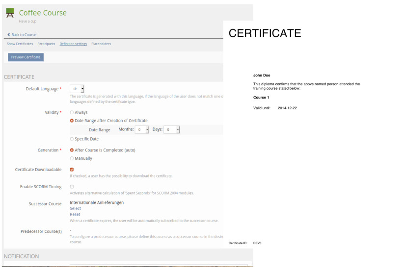

# Certificate

The certificate plugin offers an enhanced support for creating and administrating certificates inside ILIAS.



## Features

* Multiple certificate types with different layouts
* Generate pretty PDF layouts with JasperReports, the world’s most popular open source reporting engine
* Custom placeholders in certificates
* Multiple languages
* Certificates (pdf files) are stored in the ILIAS data directory instead of getting generated dynamically
* Revision of files
* Rendering PDF certificates with the integraded PDF Service in ILIAS (>= 4.4) or with JasperReports

### Requirements
* ILIAS 6 or ILIAS 7
* PHP >=7.0

## Installation
Start at your ILIAS root directory
```bash
mkdir -p Customizing/global/plugins/Services/UIComponent/UserInterfaceHook
cd Customizing/global/plugins/Services/UIComponent/UserInterfaceHook
git clone https://github.com/Jakub-eAcademy/Certificate.git Certificate
```
Update and activate the plugin in the ILIAS Plugin Administration

Please also install and enable [CertificateCron](https://github.com/studer-raimann/CertificateCron).

## Documentation

An installation and user guide is available in [the doc/Documentation.pdf](/doc/Documentation.pdf?raw=true) file.

## Custom fonts

If custom fonts are needed you can insert them inside directory below:

```
Customizing/global/plugins/Services/UIComponent/UserInterfaceHook/Certificate/vendor/rdpascua/jasperstarter/jdbc/
```

They need to have _.jar_ extension, you can generate them inside Jasper Studio.

## Jasper Studio

Before image path you need to add this parameter:

```
$P{[[CERT_TEMPLATE_PATH]]} + PATH
```
### Generate QR code
```
javax.imageio.ImageIO.read(new java.io.ByteArrayInputStream(Base64.getDecoder().decode($P{[[DIGITAL_SIGNATURE_QR_CODE]]})))
```

## Custom verification

Change the PHP code of the class responsible for displaing validation message

```
Customizing/global/plugins/Services/UIComponent/UserInterfaceHook/Certificate/classes/checkCertificate.php
```

## Known bugs

1. Incorrect java version (should be OpenJDK 8)
   ```
   srCertificateDefinitionGUI::previewCertificate:160 srCertificateTemplyteTypeJasper::generate() Report file of certificate with ID 0 was not created by Jasper: Exception in thread "main" java.lang.ClassCastException: class jdk.internal.loader.ClassLoaders$AppClassLoader cannot be cast to class java.net.URLClassLoader (jdk.internal.loader.ClassLoaders$AppClassLoader and java.net.URLClassLoader are in module java.base of loader 'bootstrap'),
   at de.cenote.tools.classpath.ApplicationClasspath.add(ApplicationClasspath.java:75),
   at de.cenote.tools.classpath.ApplicationClasspath.add(ApplicationClasspath.java:65),
   at de.cenote.tools.classpath.ApplicationClasspath.addJars(ApplicationClasspath.java:134),
   at de.cenote.tools.classpath.ApplicationClasspath.addJarsRelative(ApplicationClasspath.java:151),
   at de.cenote.jasperstarter.App.processReport(App.java:178),
   at de.cenote.jasperstarter.App.main(App.java:109)
   ```
